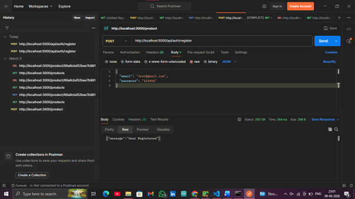
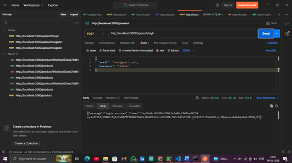
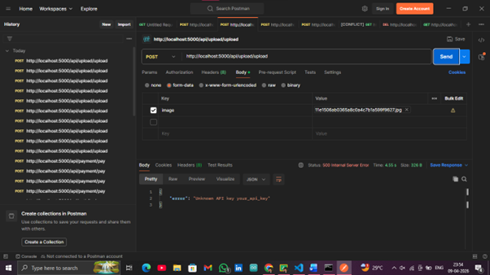
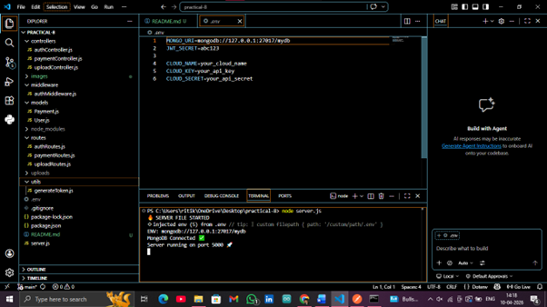

# Authentication & Testing API

## Project Overview
This project implements authentication and testing features using Node.js and Express. It includes JWT-based authentication, payment mockup, image upload, deployment, and API testing using Postman.


## AIM
To implement authentication, file upload, payment mockup, deployment, and API testing in a backend application.


## Objective
- Implement JWT Authentication
- Upload images using Multer
- Simulate payment system
- Validate API data
- Test APIs using Postman
- Deploy application


## Features
- JWT Authentication (Register/Login)
- Password Hashing using bcrypt
- Protected Routes
- Payment Mock API
- Image Upload using Multer
- Input Validation
- Postman API Testing


## Tech Stack
- Node.js
- Express.js
- MongoDB
- JWT (jsonwebtoken)
- Multer


## API Endpoints
- POST /api/auth/register
- POST /api/auth/login
- POST /api/upload
- POST /api/payment

## 📸 Screenshots

### Register API


### Login API


### Upload API


### Payment API


## Environment Variables
Create a `.env` file and add:

PORT=5000  
MONGO_URI=your_mongodb_connection_string  
JWT_SECRET=your_secret_key  

## nstallation

```bash
npm install
npm start

